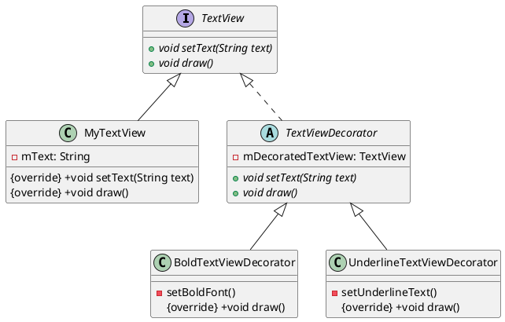

#  装饰器模式Android

以下是一个使用装饰器模式在 Android 中实现`TextView`对象的动态样式装饰示例。



1. 定义 `TextView` 接口

```java
public interface TextView {
    void setText(String text);
    void draw();
}
```

2. 定义具体 `TextView` 实现类

```java
public class MyTextView implements TextView {
    private String mText;

    @Override
    public void setText(String text) {
        mText = text;
    }

    @Override
    public void draw() {
        System.out.println("Drawing text: " + mText);
    }
}
```

3. 定义 `TextViewDecorator` 抽象类

```java
public abstract class TextViewDecorator implements TextView {
    protected TextView mDecoratedTextView;

    public TextViewDecorator(TextView decoratedTextView) {
        mDecoratedTextView = decoratedTextView;
    }

    public void setText(String text) {
        mDecoratedTextView.setText(text);
    }

    public void draw() {
        mDecoratedTextView.draw();
    }
}
```

4. 定义具体 `TextViewDecorator` 实现类

```java
public class BoldTextViewDecorator extends TextViewDecorator {
    public BoldTextViewDecorator(TextView decoratedTextView) {
        super(decoratedTextView);
    }

    public void draw() {
        mDecoratedTextView.draw();
        setBoldFont();
    }

    private void setBoldFont(){
        System.out.println("Setting bold font for the text view");
    }
}
```

```java
public class UnderlineTextViewDecorator extends TextViewDecorator {
    public UnderlineTextViewDecorator(TextView decoratedTextView) {
        super(decoratedTextView);
    }

    public void draw() {
        mDecoratedTextView.draw();
        setUnderlineText();
    }

    private void setUnderlineText(){
        System.out.println("Setting underline text for the text view");
    }
}
```

5. 测试代码

```java
TextView textView = new MyTextView();
textView.setText("Hello, World!");
textView.draw();

TextView boldTextView = new BoldTextViewDecorator(new MyTextView());
boldTextView.setText("Hello, World!");
boldTextView.draw();

TextView underlinedTextView = new UnderlineTextViewDecorator(new MyTextView());
underlinedTextView.setText("Hello, World!");
underlinedTextView.draw();

TextView boldUnderlinedTextView = new BoldTextViewDecorator(new UnderlineTextViewDecorator(new MyTextView()));
boldUnderlinedTextView.setText("Hello, World!");
boldUnderlinedTextView.draw();
```

在上述示例中，我们使用装饰器模式创建了两个不同的装饰器：`BoldTextViewDecorator` 和 `UnderlineTextViewDecorator`，这两个装饰器分别为 `TextView` 对象增加了加粗字体和下划线效果。我们通过 `MyTextView` 类定义了一个简单的 TextView 基类，并通过组合方式来让装饰器对象持有需要被装饰的 `TextView` 对象。最后，在测试代码中分别为原始的文本、加粗文本、下划线文本和加粗且下划线的文本调用 `setText()` 和 `draw()` 方法。

## 运用

在 Android 中，有许多典型的装饰器应用。以下列举几个常见的示例：

1. `Intent` 装饰器：Android 中的 `Intent` 类可以用来启动活动、服务或广播等组件，通过创建不同的 `Intent` 实例控制各种操作，而一些基于功能扩展的第三方库（如 EventBus 和 RxJava 等）会使用 `Intent` 对象进行事件传递。此外，Android 还提供了一些基于 `Intent` 的装饰器类，例如 `IntentService` 和 `PendingIntent` 等，它们都是 `Intent` 的具体实现，并为 `Intent` 增加了新的功能。

2. `View` 装饰器：在 Android 中，我们可以使用 `View` 对象来构建用户界面，`View` 对象是 Android 应用中最基本的元素之一。除了自定义 `ViewGroup` 和 `View` 之外，在 Android 中还有一些内置的视图装饰器，例如 `TextView`、`ImageView`、`ProgressBar` 等。这些装饰器提供了许多实用的方法和属性，使得我们可以快速地创建各种类型的视图，并且可以方便地对视图进行修改和扩展。

3. `Loader` 装饰器：在 Android 中，`Loader` 是一个抽象类，用于异步加载和管理数据库和其他数据源中的数据。Android 中提供了一些具体的 `Loader` 实现，如 `CursorLoader`、`AsyncTaskLoader` 等，它们将 `Loader` 抽象类封装在内部，并为其增加了新的功能，如异步加载和自动重新加载等。

4. `Fragment` 装饰器：在 Android 中，`Fragment` 是一个可重用的组件，可以用来构建复杂的用户界面并管理其生命周期。Android 中提供了一些内置的 `Fragment` 实现，如 `ListFragment`、`DialogFragment` 等，这些实现都是基于 `Fragment` 抽象类封装而成，并增加了许多附加功能，如列表视图、对话框等。

5. `Permission` 装饰器：在 Android 中，应用必须获取权限才能执行某些操作（例如访问网络、读取文件等）。为了提高代码的可维护性和复用性，我们通常会对权限进行封装，以实现更细粒度的控制和更好的安全性。其中， `Permission` 装饰器就是一种常见的封装方式，通过创建不同的权限装饰器来实现不同的权限访问控制。