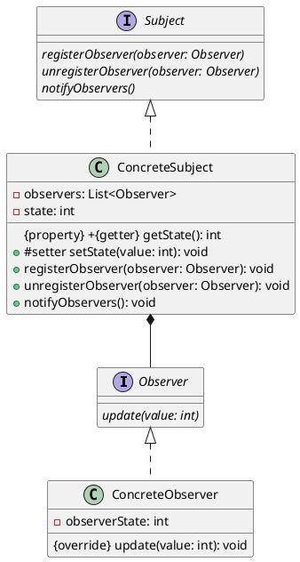

# 观察者模式Java

以下是一个使用 Java 编写的观察者模式示例，同时附上使用 PlantUML 生成的类图：




```java
import java.util.ArrayList;
import java.util.List;

interface Observer {
    void update(int value);
}

interface Subject {
    void registerObserver(Observer observer);

    void unregisterObserver(Observer observer);

    void notifyObservers();
}

class ConcreteSubject implements Subject {
    private List<Observer> observers = new ArrayList<>();
    private int state;

    public void setState(int state) {
        this.state = state;
        notifyObservers();
    }

    public int getState() {
        return state;
    }

    @Override
    public void registerObserver(Observer observer) {
        observers.add(observer);
    }

    @Override
    public void unregisterObserver(Observer observer) {
        observers.remove(observer);
    }

    @Override
    public void notifyObservers() {
        for (Observer observer : observers) {
            observer.update(state);
        }
    }
}

class ConcreteObserver implements Observer {
    private int observerState;

    @Override
    public void update(int value) {
        observerState = value;
        System.out.println("Observer state updated: " + observerState);
    }
}

public class ObserverPatternDemo {

    public static void main(String[] args) {
        ConcreteSubject subject = new ConcreteSubject();

        ConcreteObserver observer1 = new ConcreteObserver();
        ConcreteObserver observer2 = new ConcreteObserver();

        subject.registerObserver(observer1);
        subject.registerObserver(observer2);

        subject.setState(1);
        subject.unregisterObserver(observer2);
        subject.setState(2);
    }
}
```

在上述示例中，我们定义了三个接口：`Observer`、`Subject` 和 `ConcreteSubject`，分别代表观察者、主题和具体主题。其中，`Subject` 接口定义了注册、注销和通知观察者的方法，并保留了一个观察者列表。`ConcreteSubject` 类是主题的具体实现，它维护了一组整型状态并有状态设置和获取方法。在 `ConcreteSubject` 中，当状态发生改变时，会调用 `notifyObservers()` 方法通知所有已注册的观察者进行更新。`Observer` 接口声明了一个更新数据的方法 `update(int value)`，而 `ConcreteObserver` 是观察者接口的具体实现，在收到状态更新后，将状态值输出到控制台。

在测试代码中，我们首先创建了一个 `ConcreteSubject` 对象，并创建了两个 `ConcreteObserver` 观察者对象，并将它们注册到主题对象中。接着，我们手动修改了主题状态并取消其中一个观察者的订阅。在此过程中，我们可以看到观察者 `Observer.update()` 方法被成功调用，更新了自身数据。