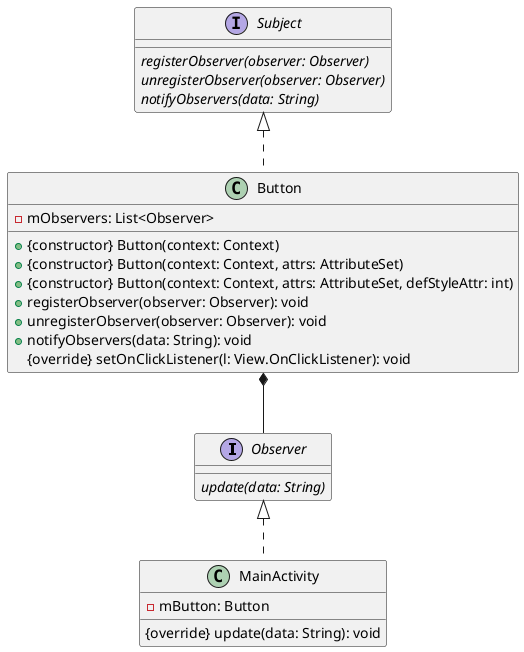

# 观察者模式Android

以上流程是一个观察者模式的示例。

该设计模式用于通过多个观察者来监视和响应主题对象中的状态变化。

在该示例中, 
1. `Subject` 接口定义了注册、注销和通知观察者的方法；
2. `Observer` 接口定义了更新数据的方法；
3. `Button` 类是观察主题的具体实现，在其中重写了 `setOnClickListener()` 方法，并包含了一个维护已注册观察者的列表。
4.  `MainActivity`是一个具体的观察者，它实现了 `Observer` 接口并在收到通知后更新了 UI。
> 此外，在 Android 应用程序中，为了更新 UI 操作必须在 UI 线程上执行，因此我们使用了 `runOnUiThread()` 来确保操作在线程上运行。



在这个例子中，我们将演示如何使用观察者模式在 Android 应用程序中实现点击事件的通知和响应。

首先，我们定义一个 `Subject` 接口，其中声明了注册、注销和通知观察者的方法：

```java
public interface Subject {
    // 注册
    void registerObserver(Observer observer);
    // 解除注册
    void unregisterObserver(Observer observer);
    // 通知
    void notifyObservers(String data);
}
```

接着，我们定义一个 `Observer` 接口，其中声明了一个更新状态的方法：

```java
public interface Observer {
    // 更新
    void update(String data);
}
```

然后，我们定义一个具体主题类 `Button`，它继承了 `android.widget.Button` 并实现了 `Subject` 接口。在 `Button` 中，我们重写了 `setOnClickListener()` 方法，在其中调用了 `notifyObservers()` 方法，通知所有已注册的观察者进行更新：

```java
public class Button extends android.widget.Button implements Subject {

    private List<Observer> mObservers = new ArrayList<>();

    public Button(Context context) {
        super(context);
    }

    public Button(Context context, AttributeSet attrs) {
        super(context, attrs);
    }

    public Button(Context context, AttributeSet attrs, int defStyleAttr) {
        super(context, attrs, defStyleAttr);
    }

    @Override
    public void registerObserver(Observer observer) {
        if (!mObservers.contains(observer)) {
            mObservers.add(observer);
        }
    }

    @Override
    public void unregisterObserver(Observer observer) {
        mObservers.remove(observer);
    }

    @Override
    public void notifyObservers(String data) {
        for (Observer observer : mObservers) {
            observer.update(data);
        }
    }

    @Override
    public void setOnClickListener(View.OnClickListener l) {
        super.setOnClickListener(v -> {
            String data = "Button clicked";
            notifyObservers(data);
            if (l != null) {
                l.onClick(v);
            }
        });
    }
}
```

最后，我们定义一个具体观察者类 `MainActivity`，它实现了 `Observer` 接口并在收到通知后更新了 UI：

```java
public class MainActivity extends AppCompatActivity implements Observer {

    private Button mButton;

    @Override
    protected void onCreate(Bundle savedInstanceState) {
        super.onCreate(savedInstanceState);
        setContentView(R.layout.activity_main);

        mButton = findViewById(R.id.button);
        mButton.registerObserver(this);
    }

    @Override
    public void update(String data) {
        runOnUiThread(() -> Toast.makeText(MainActivity.this, data, Toast.LENGTH_SHORT).show());
    }
}
```

在 `MainActivity` 中，我们注册了当前对象为观察者，并在 `update()` 方法中更新了 UI。需要注意的是，在 `update()` 方法中我们使用了 `runOnUiThread()`，这是因为 `Button` 类是在单独的线程上运行的（UI 线程和按钮回调线程不同），而更新 UI 操作必须在 UI 线程上执行。