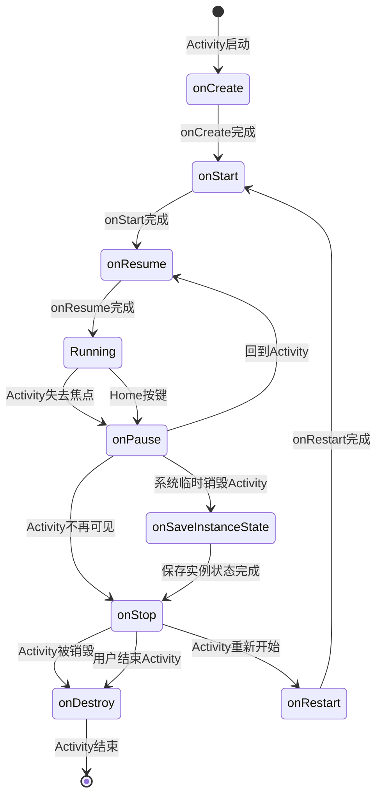

# 安卓面试宝典

我的安卓面试宝典和，我的好助手ChatGPT4。

 

背水一战！

```mermaid
stateDiagram-v2
[*] --> onCreate: Activity启动
onCreate --> onStart: onCreate完成
onStart --> onResume: onStart完成
onResume --> Running: onResume完成
Running --> onPause: Activity失去焦点
onPause --> onStop: Activity不再可见
onStop --> onDestroy: Activity被销毁
onDestroy --> [*]: Activity结束

Running --> onPause: Home按键
onPause --> onResume: 回到Activity

onStop --> onRestart: Activity重新开始
onRestart --> onStart: onRestart完成

onPause --> onSaveInstanceState: 系统临时销毁Activity
onSaveInstanceState --> onStop: 保存实例状态完成

onStop --> onDestroy: 用户结束Activity
```